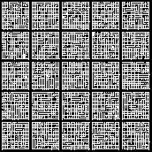
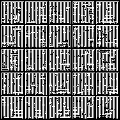
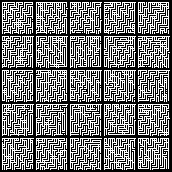
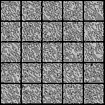

# GAN-textures
Is it possible to generate a procedural game and use only neurals networks trained on many many different things to make a game eg. train a DCGAN on maze to generate tiles for the background.

## Credits

Credits where it is due, for maze I modified the code [here](https://github.com/boppreh/maze)
